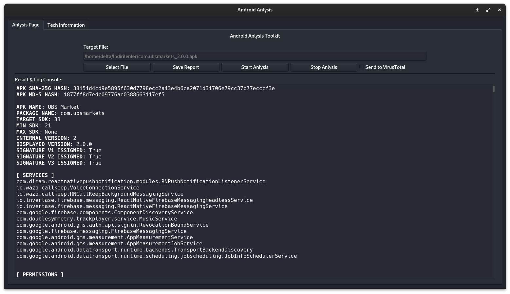

<h1 aling=center>TheHive Remastred</h1>

Gelişmiş ve Profesyonel OSINT TheHive Remastred ile Sizin Elinizde!
 

- TheHive Remastred:
    - Gelişmiş ve basit grafiksel arayüz
    - Yerel kimlik doğrulaması ile karıştırmaya karşı koruma
    - Açık kaynak ve ücretsiz
    - Gelişmiş Özellikleri
        - Yüz tanıma 
        - Yüz tespit 
        - Yüz karşılaştırma ( Aktif )
        - Tersine IP Taraması ( Aktif )
        - BIN Numarası Arama ( Aktif )
        - Statik Android APK Analizi ( Aktif )
        - Clone voice detections ( çok yakında )
        - Iban Çözümleyici ( Aktif)
        - Video kare ayrıştırıcı ( Aktif)
        - Telefon Numarası analiz edici ( Aktif )
        - Google Drok oluşturucu ( çok yakında )
        - Hash Tipi Tespit edici ( çok yakında )
        - Harici Modül Desteği ( çok yakında )

        - Bölge Tabanlı Sistemler
            - Tc Verificator ( Aktif ) 
            - Tc Calculator ( Aktif )

 

<h1> İndirme ve ilk kurulum </h1>

<h3> <a href="./documents/Linux Kurulumu.md">Linux Üzerinde TheHive Kurulumu </a> </h3>
<h3> <a href="./documents/Windows Kurulumu.md">Windows Üzerinde TheHive Kurulumu </a> </h3>

 
<h1>Arayüzden Görüntüler</h1>

 

## Karşılama Ekranı

 

 

TheHive ilk girişte basit bir arayüz ile sizi karşılar, temel sistem bilgisi ve iletişim 
bilgileri içeren bu sayfa üzerinden diğer modullere erişim sağlanır.

 

## Ses Tanıma

 

 

python Resamblyzer kütüphanesini temel alan bir ses doğrulama & tanıma sistem TheHive içerisinde mevcuttur. Kütüphanenin güncellenmesi nedeniyle tekrar entegre edilmesi için şuan bakım moduna alınmıştır.

 

## Yüz Tanıma

 

### Veritabanı içerisinde mevcut bir yüzün/kişinin aranması

### Veritabanı içerisinde bulunmayan bir yüzün/kişinin aranması

 

Görüntünün saf ikili verileri, tekrarlanan görüntülere karşı koruma sağlamak için sha1 karması, hızlı karşılaştırma için referans noktaları, yüzün genel noktaları, yüz çerçevesi, sisteme eklenme adı, UTC'ye eklenme tarihi veritabanında saklanır, böylece yüksek hızlı arama. 1500 rastgele görüntü ile yapılan deneylerde Yanlış pozitif (sistemin doğru olduğunu düşündüğü ancak yanlış olduğu) bir duruma rastlamadık. Benzerlik hesaplamasında yüz modelleri yerine kosinüs benzerliği kullanıldığı için aynı kişinin farklı görüntülerinde oran %100 olmayacak ancak diğerleriyle karşılaştırıldığında ciddi bir fark yaratacaktır. Bu sayede sistem verimli çalışır.

35.000 rastgele görüntü üzerinde yapılan deney sonucunda benzerlik alt sınırı %35'e düşürülerek hatalı sonuçların geri dönmesinin önüne geçildi.
 

## Yüz Doğrulama

 

### Aynı kişiye ait yüzlerin verdiği sonuç

### Farklı insanların yüzlerindeki sonuçlar

 

Farklı kişilerin tespiti ile aynı kişilerin tespiti arasında yüksek oranda fark bulunmaktadır. InsightFace'in buffalo_l modeli yüz noktalarını tespit etmek için kullanılır, daha sonra numpy aracılığıyla kosinüs benzerlik formülü kullanılarak benzerliğin hesaplanması sağlanır, bu nedenle aynı kişilerin farklı fotoğraflarında %100 vermez.
 

## Yüz Tespiti

 

Analiz hakkında tüm detayları almak için tüm analiz sonuçları diğer sekmede yazdırılır.

 

## Video Kare Ayrıştırıcı

 

 

Videoların daha kolay ve detaylı incelenebilmesi için opencv tabanlı video kare ayrıştırma özelliği, çoklu iş parçacığı özelliği sayesinde videoları karelere ayırarak uygulama donmadan tüm durumu ekrana verir

 

## Iban Çözümleyici

 

 

Ödeme işlemlerinde sıklıkla kullanılan IBAN, belirli bilgileri içerir. Bazı açık kaynak bilgilerine analiz ederek erişebilirsiniz. Bu modül bunu otomatik olarak yapar. Şu anda sadece Türkiye'ye ait IBAN'lara tam destek verilmektedir. Diğer IBAN'lar için eksik bilgi vermesi mümkündür.

 

## Basit IP Takibi

 

 

## Basit BIN Numrası Takibi

 

 

## Statik Android APK Analizi:

 

 

## Ses Dönüştürücü 

 

 

Bu araçta pek gerekli olmasa da öğrenme aşamasında yazdığım ses dönüştürücüyü eklemek istedim:)

 

# Credit[s]

Logo Tasarımcısı <a hred="https://github.com/omersayak">Ömer Şayak</a>

