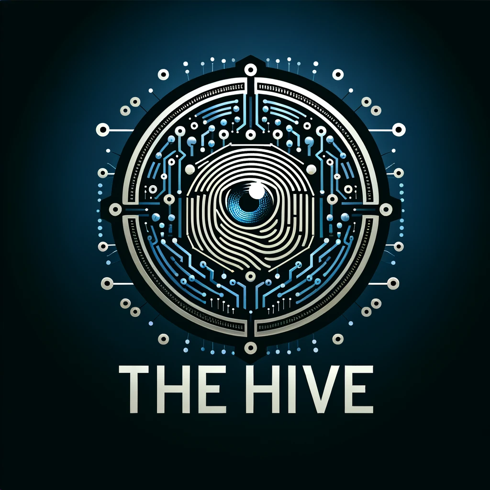
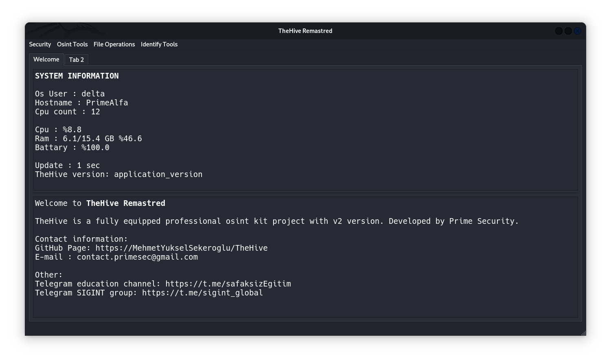
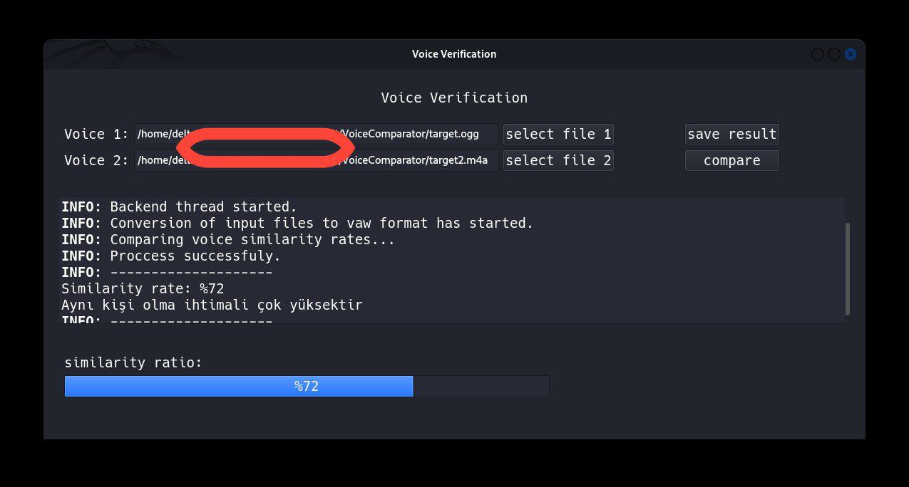
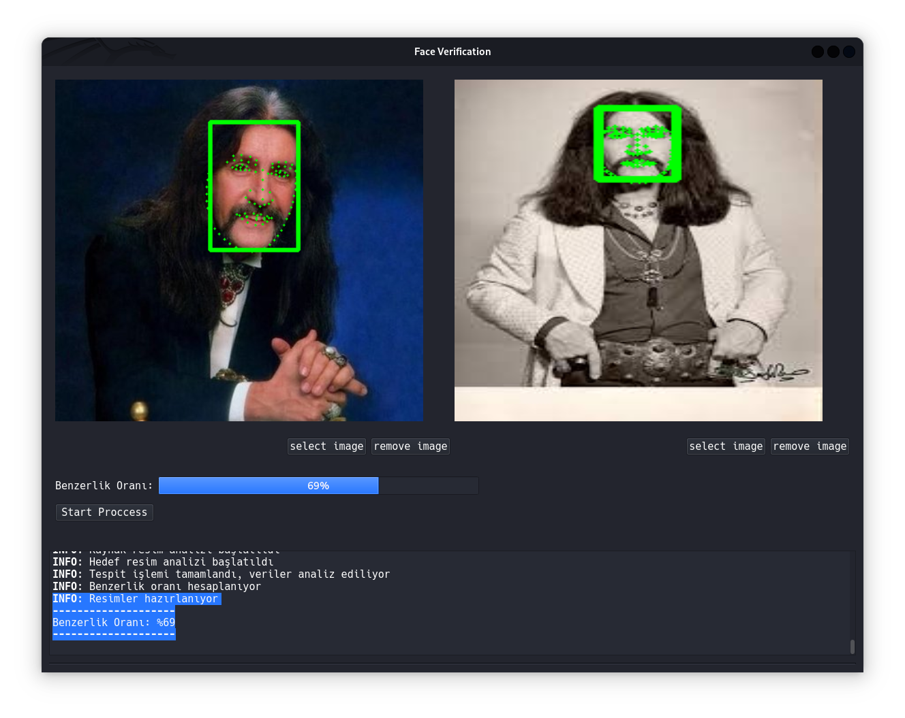
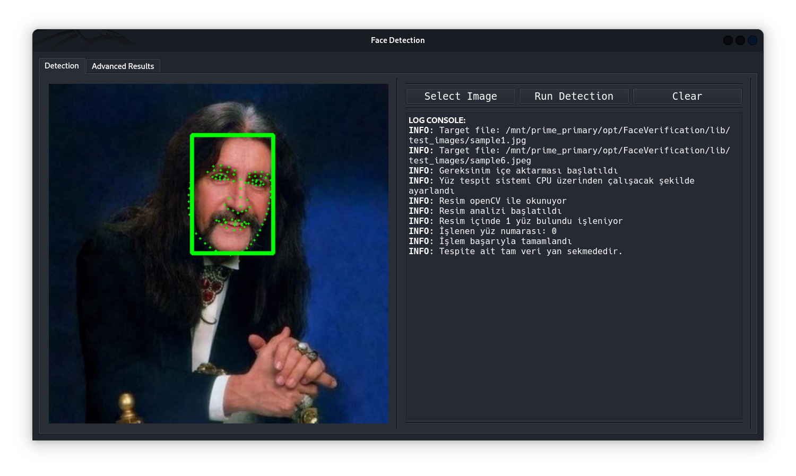
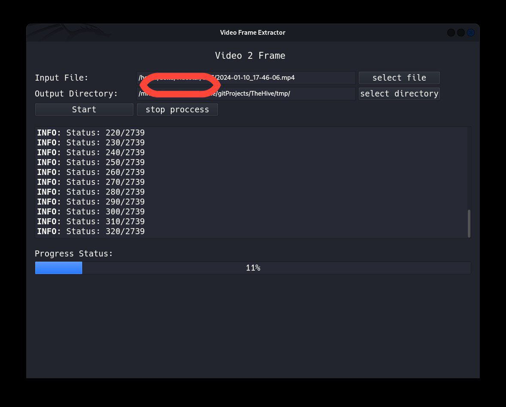
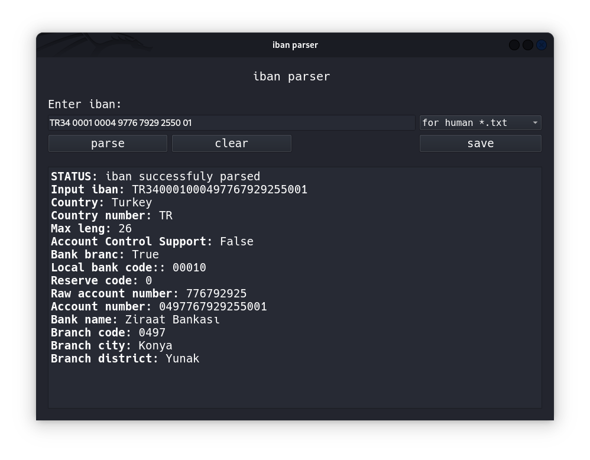
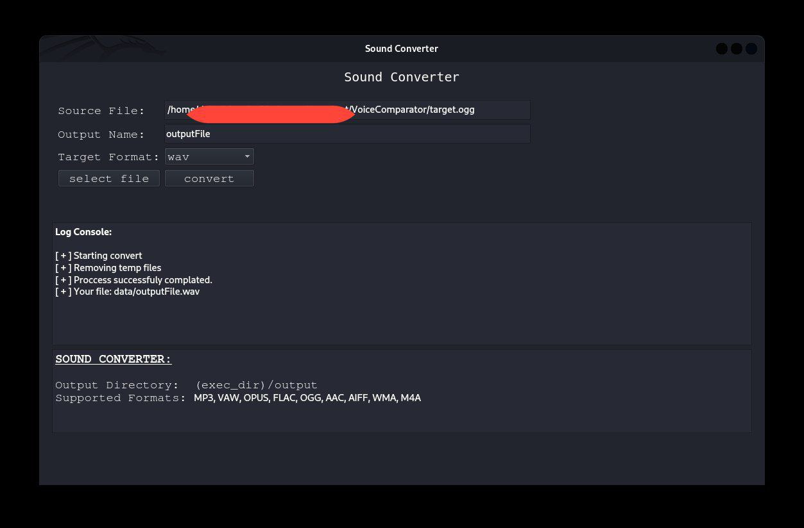

<h1 aling=center>TheHive Remastred</h1>

<div align="center"  >


</div>

<p>Advanced professional osint toolkit with TheHive Remastred</p><br>


- TheHive Remastred:
    - Advanced and easy graphical interface
    - Local authentication to prevent files from being scrambled
    - Open soruce & Free
    - Extensive features
        - Face recognition ( coming soon )
        - Face detection (Now Active)
        - Face verification ( Now Active )
        - Voice verification ( Now Active)
        - Clone voice detections ( coming soon )
        - Iban parser ( Now Active)
        - Video frame extractor ( Now Active)
        - Phone number parser ( Now Active )
        - Google dork generator ( coming soon )
        - Hash identify ( coming soon )
        - External module support ( coming soon )

        - Region based tools
            - Tc Verificator ( math algorithm ) ( Now Active ) 
            - Tc Calculator ( math algorithm ) ( Now Active )


<br>

<h1> Installation and Startup </h1>
<br>

## Direct Installing ( No python venv )

<br>

```shell
# Clone the repo
git clone https://github.com/MehmetYukselSekeroglu/TheHive.git

# Join TheHive directory
cd TheHive

# Install requirements
python -m pip install -r requirements.txt

# Start Application 
python main.py

```

<br>

## Installing with python venv

<br>


```shell
# Clone the repo
git clone https://github.com/MehmetYukselSekeroglu/TheHive.git

# Join TheHive directory
cd TheHive

# Generate new virtaul env
python -m venv .venv

# Activate venv
.venv\Scripts\activate # Windows
source .venv/bin/activate # Linux and MacOS

# Install requirements for venv
python -m pip install -r requirements.txt

# Start Application 
python main.py

# To exit the virtual environment ( All Platforms )
deactivate

```


<br>
<h1>Images from the interface</h1>

<br>

## Welcome Screen

<br>



<br>


## Voice Verification

<br>



<br>

## Face Verification

<br>

### Result given by faces belonging to the same person



### The results on different people's faces

<br>

<p>There is a high rate of difference between the detection of different and the same people. InsightFace's buffalo_l model is used to detect facial points, then the cosine similarity formula is used via numpy to calculate the similarity, which is why it does not give 100% in different pictures of the same people.
<br>

## Face Detection

<br>



## Video Frame Extractor

<br>



<br>


## Iban Parser

<br>

<br>


## Sound Converter 

<br>




<br>

# Credit[s]

<p>
Logo Designer <a hred="https://github.com/omersayak">Ömer Şayak</a>

</p>