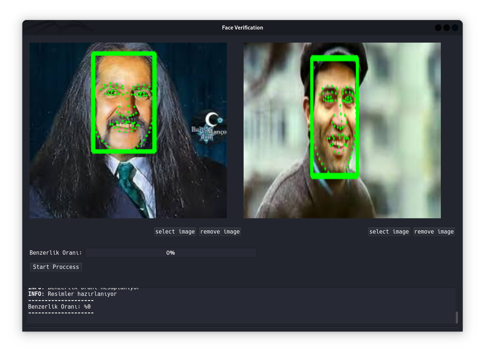

<h1 aling=center>TheHive Remastred</h1>

<div align="center"  >


</div>

<p>Advanced professional osint toolkit with TheHive Remastred</p><br>


- TheHive Remastred:
    - Advanced and easy graphical interface
    - Local authentication to prevent files from being scrambled
    - Open soruce & Free
    - Extensive features
        - Face recognition ( Active )
        - Face detection ( Active)
        - Face verification ( Active )
        - Reverse IP lookup ( Active )
        - BIN lookup ( Active )
        - Android APK analysis ( Active )
        - Voice verification ( Active)
        - Clone voice detections ( coming soon )
        - Iban parser ( Active)
        - Video frame extractor ( Active)
        - Phone number parser ( Active )
        - Google dork generator ( coming soon )
        - Hash identify ( coming soon )
        - External module support ( coming soon )

        - Region based tools
            - Tc Verificator ( Active ) 
            - Tc Calculator ( Active )


<br>

<h1> Installation and Startup </h1>
<br>

## Preparing the PostgreSQL server

<br>
<p>
TheHive is powered by PostgreSQL, one of the most powerful relational database systems, to keep a high amount of data, analyze it quickly when necessary, and add more data. Since it cannot install the server automatically, you need to install a normal Postgresql server and run the command below.</p>

```SQL
CREATE DATABASE thehive;
```

<br>


Şimdi ise bağlantı sağlanabilmesi için `hivelibrart/psqlConfig.py`  yapılandırma dosyasına gerekli bilgileri girmeniz gerekir ardından diğer adıma geçebilirsiniz


open this file hivelibrart/psqlConfig.py

```python


from hivelibrary.env import DATABASE_NAME
# enter the postgresql database server connection info
POSTGRESQL_CONFIG = {
    "host":"localhost",
    "port":"5432",
    "user":"postgres",
    "password":"change_it", # change this
    "database":DATABASE_NAME
}


```

<br>

## Direct Installing ( No python venv )

<br>

```shell
# Clone the repo
git clone https://github.com/MehmetYukselSekeroglu/TheHive.git

# Join TheHive directory
cd TheHive

# Install requirements
python -m pip install -r requirements.txt

# Start Application 
python main.py

```

<br>

## Installing with python venv

<br>


```shell
# Clone the repo
git clone https://github.com/MehmetYukselSekeroglu/TheHive.git

# Join TheHive directory
cd TheHive

# Generate new virtaul env
python -m venv .venv

# Activate venv
.venv\Scripts\activate # Windows
source .venv/bin/activate # Linux and MacOS

# Install requirements for venv
python -m pip install -r requirements.txt

# Start Application 
python main.py

# To exit the virtual environment ( All Platforms )
deactivate

```


<br>
<h1>Images from the interface</h1>

<br>

## Welcome Screen

<br>


<br>
<p>A simple welcome screen welcomes you. At the top, there is the latest status of the system and TheHive, and at the bottom, there is brief information about the vehicle and producer contact information. In general, most operations are performed through the menu bar.</p>

<br>


## Voice Verification

<br>


<br>

<p>Thanks to Resemblyzer-based voice verification, you can understand whether 2 voice samples belong to the same person or to others. Thanks to Resemblyzer, the parts of the voice for analysis are detected and the similarity ratio is calculated using cosine similarity. Generally, rates of 75% and above belong to the same person, but do not forget that the model may be wrong.</p>
<br>


## Face Recognition

<br>

### Searching for a face in the database


### Searching for a face that is not in the database

<br>


<p>Pure binary data of the image, sha1 hash to protect against repeated images, reference points for quick comparison, general points of the face, face frame, name of addition to the system, date of insertion in UTC are stored in the database, thus enabling high-speed searching. In the experiments carried out with 1500 random images, we have not come across a False positive (what the system thinks is correct, but it is wrong) situation. Since cosine similarity is used instead of face models for similarity calculation, the rate will not be 100% in different images of the same person, but it creates a significant difference when compared with others. In this way, the system works efficiently.


As a result of the experiment conducted on 35,000 random images, the lower limit of similarity was reduced to 35%, thus preventing erroneous results from being returned.
<br>


## Face Verification

<br>

### Result given by faces belonging to the same person


### The results on different people's faces

<br>

<p>There is a high rate of difference between the detection of different and the same people. InsightFace's buffalo_l model is used to detect facial points, then the cosine similarity formula is used via numpy to calculate the similarity, which is why it does not give 100% in different pictures of the same people.
<br>

## Face Detection

<br>


<p>All analysis results are printed in the other tab to get full details about the insightFace based face detection system detections for the detection system and trials before the face verification system</p>

<br>


## Video Frame Extractor

<br>


<br>
<p>In order to examine the videos more easily and in detail, the opencv-based video frame parsing feature separates the videos into frames, giving the entire status to the screen without the application freezing, thanks to its multi-threading feature</p>
<br>


## Iban Parser

<br>

<br>
<p>IBAN, which is frequently used in payment transactions, contains certain information. You can access certain open source information by analyzing them. This module does this automatically. Currently, there is full support only for IBANs belonging to Turkey. It is possible that it may provide incomplete information for other IBANs.</p>
<br>


## Reverse IP lookup (Basic):

<br>

<br>


## BIN Lookup (Basic):

<br>

<br>


## Android APK Static Analysis:

<br>

<br>


## Sound Converter 

<br>


<br>
<p>Although it is not necessary in this tool, I wanted to add the audio converter that I wrote during the learning phase :)</p>

<br>


# Credit[s]

<p>
Logo Designer <a hred="https://github.com/omersayak">Ömer Şayak</a>

</p>