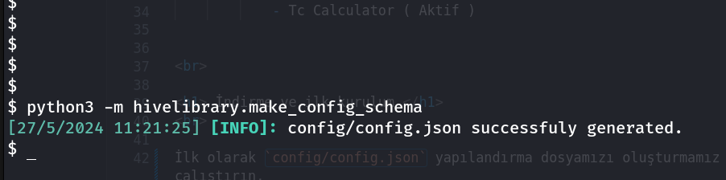
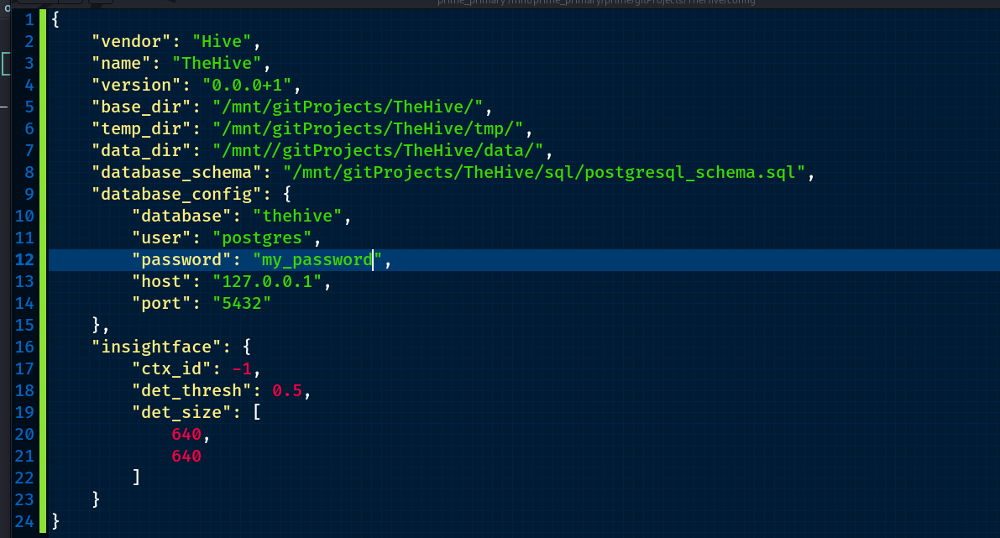

Öncelikle Repomuzu GitHub dan çekerek içerisinde girelim sonra diğer adımlara geçebiliriz.

```shell
git clone https://github.com/MehmetYukselSekeroglu/TheHive.git
cd TheHive
```


## 1) Config Dosyasını Oluşturma

İlk olarak `config/config.json` yapılandırma dosyamızı oluşturmamız gerekiyor. Bunun için proje klasörü içinde şu komutu çalıştırın.

```shell 
python3 -m hivelibrary.make_config_schema
```


Eğer aşşağıdaki gibi bir sonuç aldıysanız başarıyla oluşturulmuştur.




## 2) Config Dosyasına Ayarlarımızı Girelim 

NOT: Eğer özel bir PostgreSQL parolası istemiyorsanız bu alanı atlayın.

Herhangi bir metin editörü ile `config/config.json` dosyamızı açalım. Bu dosyada sadece database config içinde `password` kısmına istediğiniz veritabanı parolasını yazmanız yeterli isterseni olduğu gibi de bırakabilirsiniz.

Config Dosyasının içeriği aşşağıdaki gibi otomatik oluşturulmuş olacaktır. Gerekli kısma parola yazıp kaydedip çıkabilirsiniz.





## 3) Kurulumun başlatılması

Otomatik kurulum işletimini başlatmadan önce kullandığınız linux dağıtımı için `libpq-dev` , `python3` , `python3-dev` , `python3-pip` , `docker`'i kurmanız gerekli.


Eğer paketleri kurduysanız otomatik kurulumu başlatabilirsiniz. Aşşağıdaki gibi.

NOT: Otomatik indirme sistemi `sudo` veya direk olarak `root` ile çalışmaz gerekli olduğu zaman sizden parola ister.

```shell
bash linux.sh --wizard
 ```


Kurulum tamamlandığı zaman otomatik olarak TheHive açılacaktır. 


## 4) Kurulum sonrası elle başlatma


```shell
bash linux.sh --start-hive
 ```


<br>