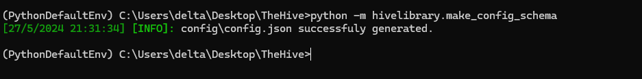
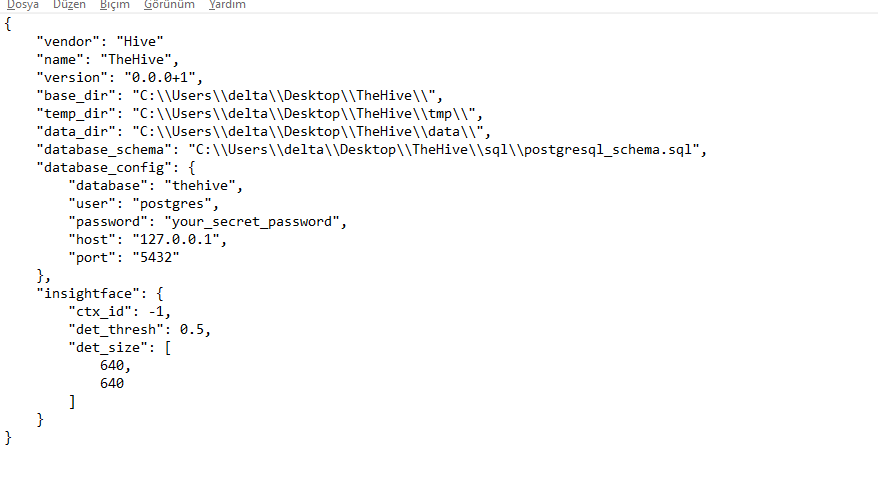
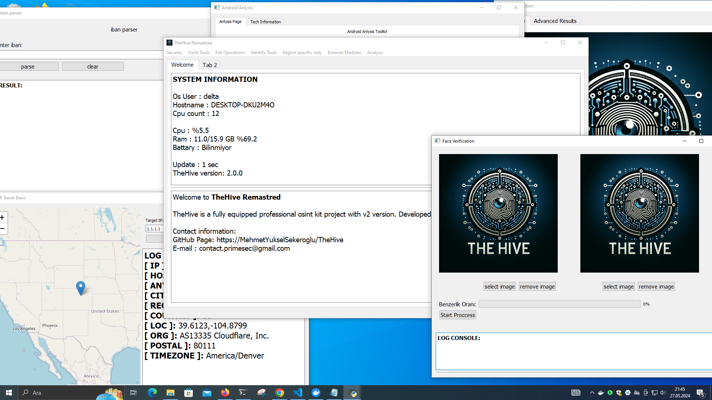

Windows için kuruluma başlamadan önce `docker`, `git` ve `python3`paketlerini sisteme kurmamız gerekli.


Docker'i indirmek için <a href="https://www.docker.com/products/docker-desktop/"> tıklayın </a>
Python3'ü indirmek için <a href="https://www.python.org/downloads/release/python-3110/"> tıklayın </a>
Git'i indirmek için <a href="https://git-scm.com/downloads"> tıklayın </a>


Öncelikle Repomuzu GitHub dan çekerek içerisinde girelim sonra diğer adımlara geçebiliriz.

```shell
git clone https://github.com/MehmetYukselSekeroglu/TheHive.git
cd TheHive
```


## 1) Config Dosyasını Oluşturma

İlk olarak `config/config.json` yapılandırma dosyamızı oluşturmamız gerekiyor. Bunun için proje klasörü içinde şu komutu çalıştırın.

```shell 
python3 -m hivelibrary.make_config_schema
```

Çıktısı aşşağıdaki gibi olmalıdır:




## 2) Config Dosyasına Ayarlarımızı Girelim 

NOT: Eğer özel bir PostgreSQL parolası istemiyorsanız bu alanı atlayın.

Herhangi bir metin editörü ile `config/config.json` dosyamızı açalım. Bu dosyada sadece database config içinde `password` kısmına istediğiniz veritabanı parolasını yazmanız yeterli isterseni olduğu gibi de bırakabilirsiniz.

Config Dosyasının içeriği aşşağıdaki gibi otomatik oluşturulmuş olacaktır. Gerekli kısma parola yazıp kaydedip çıkabilirsiniz.




## 3) Kuruluma başlayalım 

TheHive indirme işlemi için otomatik bir kurulum dosyası sağlar. Aşşağıdaki komutu proje klasörü içinde çalıştırırsanız otomatik kurulum başlayacaktır.

### NOT: Docker'in açık olması gerekli!

```shell 
python windows.py --wizard
```

Kurulum tamamlandığı zaman TheHive otomatik olaraç açılacaktır.


## 4) Kurulum sonrası elle başlatma

İster `main.py` dosyasını çalıştırın isterseniz aşşağıdaki gibi açabilirsiniz.

```shell
python windows.py --start-hive
```


# Windows Arayüzünden Örnek Bir Görüntü:





